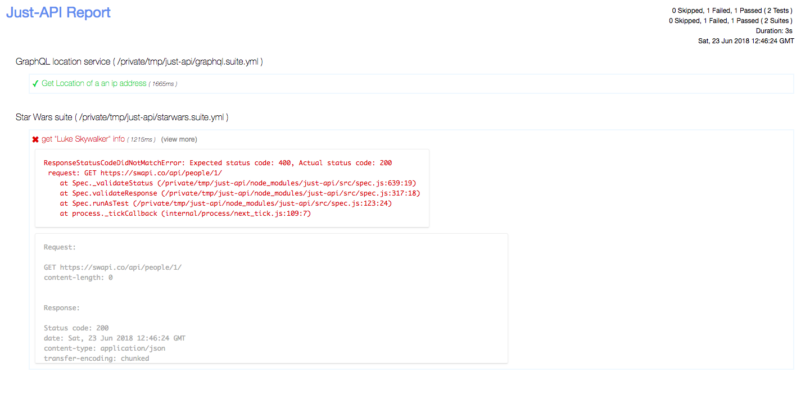

# Reporters


### Generating a report ###
Just-API has several built-in reporters, `json`, 'specs', 'html' etc.

When you need an HTML report, you can invoke just-api with the `--reporter` option

```sh
./node_modules/.bin/just-api --reporter html
```

#### A sample html report:



_Did you notice that the report has all request, response details for failed tests?_

### Generating reports in multiple formats ###

Just-API has the ability to generate reports in multiple formats.

When you need an HTML report and a JSON report too, you could do something like this

```sh
./node_modules/.bin/just-api --reporter html,json
```

This way you can generate reports in multiple formats for the same run.

### Custom Reporters ###

When built-in reporters do not provide the information you need, you can write a custom reporter and use it like:

```sh
./node_modules/.bin/just-api --reporter html,custom-reporter-module-name
```
or if the reporter is local js file 

```sh
./node_modules/.bin/just-api --reporter html,/absolute/path/to/js/file
```

Reporters in Just-API are JavaScript constructors. When instantiated, a reporter receives the test launcher object  along with program options.
Just-API emits events on launcher object and suite object, So a reporter should listen to these events and implement  custom reporting.

Following are events emitted on launcher object

 - start
 - end
 - new suite (Indicates the start of a new suite)

 And these events are emitted on each suite object

  - test pass
  - test fail
  - test skip
  - end (Indicates the end of a suite)

If you are looking to write a custom reporter, take a look at Just-API's [JSON Reporter](https://github.com/kiranz/just-api/blob/master/lib/reporters/json.js) 